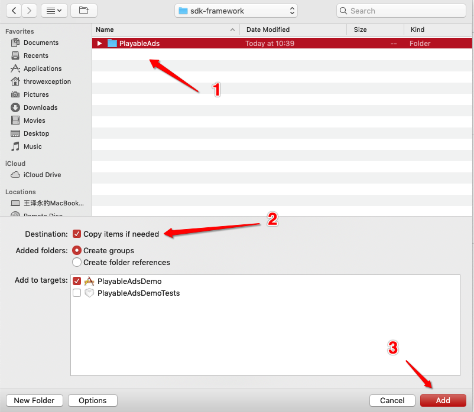
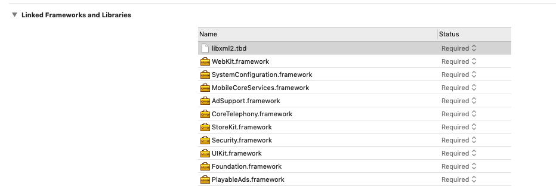

- [1. Overview](#1-overview)
  - [1.1 Introduction](#11-introduction)
  - [1.2 Develop Environment](#12-develop-environment)
  - [1.3 Terms](#13-terms)
- [2.SDK Integration](#2sdk-integration)
  - [2.1 CocoaPods (preferred)](#21-cocoapods-preferred)
    - [2.1.1 Install CocoaPods](#211-install-cocoapods)
    - [2.1.2 Switch terminal to root directory of iOS project, create podfile.](#212-switch-terminal-to-root-directory-of-ios-project-create-podfile)
    - [2.1.3 Add ZPLAY Ads SDK into Podfile](#213-add-zplay-ads-sdk-into-podfile)
    - [2.1.4 Install ZPLAY Ads SDK](#214-install-zplay-ads-sdk)
  - [2.2 Manual integration](#22-manual-integration)
    - [2.2.1 Download ZPLAY Ads SDK](#221-download-zplay-ads-sdk)
    - [2.2.2 Add to project](#222-add-to-project)
    - [2.2.3 Add the dependencies of ZPLAY Ads](#223-add-the-dependencies-of-zplay-ads)
    - [2.2.4 Others](#224-others)
- [3. Access code](#3-access-code)
  - [3.1 Rewarded Video/Intertitial Ad](#31-rewarded-videointertitial-ad)
    - [3.1.1 Initialize Video/Intertitial](#311-initialize-videointertitial)
    - [3.1.2 Show Ads](#312-show-ads)
    - [3.1.3 Determine Whether an Add Has Been Loaded](#313-determine-whether-an-add-has-been-loaded)
    - [3.1.4 Obtain Reward](#314-obtain-reward)
    - [3.1.5 Request Next Ad](#315-request-next-ad)
    - [3.1.6 Ad State Callback from PlayableAdsDelegate](#316-ad-state-callback-from-playableadsdelegate)
  - [3.2 Access Native Ad (Managed Rendering)](#32-access-native-ad-managed-rendering)
    - [3.2.1 Initialize nativeExpressAd](#321-initialize-nativeexpressad)
    - [3.2.2 Load Native Ad](#322-load-native-ad)
    - [3.2.3 Render and Display](#323-render-and-display)
    - [3.2.4 Load State Callback and Click Callback](#324-load-state-callback-and-click-callback)
  - [3.3 Access Native Ad (Self Rendering)](#33-access-native-ad-self-rendering)
    - [3.3.1 Initialize nativeAd](#331-initialize-nativead)
    - [3.3.2 Load Native Ad](#332-load-native-ad)
    - [3.3.3 Render and Display](#333-render-and-display)
    - [3.3.4 Load State Callback and Click Callback](#334-load-state-callback-and-click-callback)
  - [3.4 Banner](#34-banner)
    - [3.4.1 Init Banner](#341-init-banner)
    - [3.4.2 Request Banner](#342-request-banner)
    - [3.4.3 Implement Delegate](#343-implement-delegate)
    - [3.4.4 Destory Banner](#344-destory-banner)
- [4 Considerations](#4-considerations)
  - [4.1 Error 400](#41-error-400)
  - [4.2 Black screen when showing an ad](#42-black-screen-when-showing-an-ad)
  - [4.3 Request Ads ASAP](#43-request-ads-asap)
  - [4.4 Interstitial and Rewarded Video](#44-interstitial-and-rewarded-video)
  - [4.5 GDPR](#45-gdpr)
    - [Setting GDPR](#setting-gdpr)
- [5 Test](#5-test)


## 1. Overview

### 1.1 Introduction
This guide is designed for the developers who are going to integrate ZPLAY Ads SDK into their Xcode project.

### 1.2 Develop Environment
- OS: Mac OS X10.8.5 and above
- Development environment: Xcode7 and above
- Deployment Target: iOS8 and above

### 1.3 Terms

**APPID**: ID for your Application, obtained when setting up the app within your account on ZPLAY Ads platform.

**adUnitID**: ID for a specific ad placement within your App, as generated for your Apps within your account on ZPLAY Ads platform.  

## 2.SDK Integration

There are two ways to import ZPLAY Ads, you can choose one way from 2.1 and 2.2.

### 2.1 [CocoaPods](https://guides.cocoapods.org/using/getting-started) (preferred)
#### 2.1.1 Install CocoaPods 
```sh
sudo gem install cocoapods
```
#### 2.1.2 Switch terminal to root directory of iOS project, create podfile.
```sh
pod init
```
#### 2.1.3 Add ZPLAY Ads SDK into Podfile
```sh
pod 'PlayableAds'
```
#### 2.1.4 Install ZPLAY Ads SDK
```sh
pod install
```

If you're new to CocoaPods, see their [official documentation](https://guides.cocoapods.org/using/using-cocoapods) for info on how to create and use Podfiles.

### 2.2 Manual integration
#### 2.2.1 Download ZPLAY Ads SDK
Download ZPLAY Ads SDK [**HERE**](https://github.com/zplayads/PlayableAdsDemo-iOS/tree/master/sdk-framework). When completed, please unzip .zip file to obtain PlayableAds.
#### 2.2.2 Add to project
Add the PlayableAds files you obtained in 2.2.1 to project.


#### 2.2.3 Add the dependencies of ZPLAY Ads
The dependency frameworks of ZPLAY Ads consist of UIKit, Foundation, WebKit, SystemConfiguration, MobileCoreServices, AdSupport, CoreTelephony, StoreKit, Security.

The dependency libraries of ZPLAY Ads is xml2.

After importing: 
#### 2.2.4 Others
Find Build Settings page in the project, add $(SDKROOT)/usr/include/libxml2 into Header Search Paths under Search Paths, and add -ObjC into Other Linker Flags under Linking.


## 3. Access code

### 3.1 Rewarded Video/Intertitial Ad

#### 3.1.1 Initialize Video/Intertitial

Initialize ZPLAY Ads, show ad.
> To pre-load an ad may take several seconds, so it’s recommended to initialize the SDK and load ads as early as possible. Please fill in the APPID and adUnitID you obtained on ZPLAY Ads platform When initializing the SDK.


```objective-c
@import PlayableAds;

@interface ViewController () <PlayableAdsDelegate>

// Create an ad and start preloading
- (PlayableAds *)createAndLoadPlayableAds {
    PlayableAds *ad = [[PlayableAds alloc] initWithAdUnitID:@"Your Ad-Unit-ID" appID:@"Your App-ID" rootViewController:self];
    ad.delegate = self;
    [ad loadAd];
    
    return ad;
}
```

#### 3.1.2 Show Ads

When an ad is ready to display, you can play it using following method:
```objective-c
// show an ad
- (void)showAd {
    // ad is not ready, do nothing
    if (!self.ad.ready) {
        return;
    }
    
    // show the ad
    [self.ad present];
}
```
#### 3.1.3 Determine Whether an Add Has Been Loaded

You can determine the availability of an ad via this callback. 
> You are available to determine in-game settings via the following method.
```objective-c
- (void)playableAdsDidLoad:(PlayableAds *)ads {
    NSLog(@"playable ads did load");
}
```
#### 3.1.4 Obtain Reward
You are available to realize this callback to reward users, only valid for rewarded video.
> When using ZPLAY Ads to show rewarded video, you should reward those who has completed watching the video already via this callback.


```objective-c
#pragma mark - PlayableAdsDelegate
// Give reward, use this callback to judge whether the reward is available.
- (void)playableAdsDidRewardUser:(PlayableAds *)ads {
    NSLog(@"playable ads did reward");
}
```

#### 3.1.5 Request Next Ad

- The SDK will request the next ad automatically when an ad has been completed or request failure. If auto-loading fails, it will retry in 30 seconds.

- If you want to request the next ad manually, please set ```playableAd.autoload = NO``` to disable auto-loading. Auto-loading is the default setting.


#### 3.1.6 Ad State Callback from PlayableAdsDelegate 

```objective-c
#pragma mark - PlayableAdsDelegate
/// video ad. Use this callback to judge whether the reward is available.   
- (void)playableAdsDidRewardUser:(PlayableAds *)ads {
    NSLog(@"Advertising successfully presented");
}
/// succeed to load ad, return object PlayableAds.
- (void)playableAdsDidLoad:(PlayableAds *)ads {
    NSLog(@"Advertising is ready to play.");
}
/// fail to load ad
- (void)playableAds:(PlayableAds *)ads didFailToLoadWithError:(NSError *)error {
    NSLog(@"There was a problem loading advertising: %@", error);
}
/// video started playing 
- (void)playableAdsDidStartPlaying:(PlayableAds *)ads{
   NSLog(@"Advertising start playing");
}
/// video ended playing 
- (void)playableAdsDidEndPlaying:(PlayableAds *)ads{
  NSLog(@"Advertising did end playing");
}
/// landingpage presented 
- (void)playableAdsDidPresentLandingPage:(PlayableAds *)ads{
  NSLog(@"Advertising start playing");
}
/// landingpage dismissed 
- (void)playableAdsDidDismissScreen:(PlayableAds *)ads{
  NSLog(@"Advertising did dismiss screen");
}
/// ad has been clicked
- (void)playableAdsDidClick:(PlayableAds *)ads{
  NSLog(@"Advertising did clicked");
}
```

### 3.2 Access Native Ad (Managed Rendering)

> Managed rendering is a rendering mode of native ad. In this mode, ad will be rendered automatically. This approach simplifies the process of accessing native ad, and you can access native ad more convient since you do not need to deal with ad rendering related issues.

#### 3.2.1 Initialize nativeExpressAd

a. Import header files in your own ViewController. For example:

```objective-c
@interface PANativeExpressAdViewController () <PANativeExpressAdDelegate>

@property (nonatomic) PANativeExpressAd *nativeExpressAd;

@end
```

b. Initialize nativeExpressAd, get ad, and set callback.

```objective-c
CGFloat width = [UIScreen mainScreen].bounds.size.width;
// adSize (size of adUnit) is set by you，SDK will return an adview which suits for the adSize
self.nativeExpressAd =
        [[PANativeExpressAd alloc] initWithAdUnitID:@"Your Ad-Unit-ID" appID:@"Your App-ID" adSize:CGSizeMake(width, 300)];
self.nativeExpressAd.delegate = self;
```

#### 3.2.2 Load Native Ad

```objective-c
[self.nativeExpressAd loadAd];
```

#### 3.2.3 Render and Display

You need to check callback state in nativeExpressAd. If the state is successful, a PANativeExpressAdView type object will be returned. You can call ```addSubview：``` method to display ads in proper place. 

> When you display ads, you need to call ```reportImpressionNativeExpressAd``` method to notify ZPLAY Ads that ad has been displayed.

#### 3.2.4 Load State Callback and Click Callback

PANativeExpressAdDelegate provides load state callback and click callback. You can judge whether ad has been loaded and whether ad has been clicked. 

```objective-c
/// Native ad (managed rendering) loading succeeded. Return object PANtiveExpressAdView
- (void)playableNativeExpressAdDidLoad:(PANativeExpressAdView *)nativeExpressAd{
  
}
/// Native ad (managed rendering) loading failed. Return error messages
- (void)playableNativeExpressAdDidFailWithError:(NSError *)error{
  
}
/// Native ad (managed rendering) has been clicked
- (void)playableNativeExpressAdDidClick:(PANativeExpressAdView *)nativeExpressAd{
  
}
```

### 3.3 Access Native Ad (Self Rendering)

> Self rendering is another rendering mode, which has high flexibility, of native ad. You can splice ad style according to your needs to make ad more suitable for your app.  

#### 3.3.1 Initialize nativeAd

a. Import header files in your own ViewController. For example:

```objective-c
@interface PAShowNativeAdViewController () <PANativeAdDelegate>

@property (nonatomic) PANativeAd *nativeAd;

@end
```

b. Initialize nativeAd, get ad, and set callback.

```objective-c
self.nativeAd = [[PANativeAd alloc] initWithAdUnitID:@"Your Ad-Unit-ID" appID:@"Your App-ID"];
self.nativeAd.delegate = self;
```

#### 3.3.2 Load Native Ad

```objective-c
[self.nativeAd loadAd];
```

#### 3.3.3 Render and Display

You need to check callback state in nativeAd. If the state is successful, a PANativeAdModel type object will be returned. Then, you need to render ad in proper time and display the ad.

> Attention:
- When the ad has been rendered and displayed, you need to notify ZPLAY Ads by calling ```reportImpression:view:``` method. 
- Call ```registerViewForInteraction: nativeAd:``` method to relate PANativeAd and UIView (view you used to display native ad). Please ensure related view ```view.userInteractionEnabled = YES;``` . 


#### 3.3.4 Load State Callback and Click Callback

PANativeAdDelegate provides load state callback and click callback. You can judge whether ad has been loaded and whether ad has been clicked. 

```objective-c
/// Native ad (self rendering) loading succeeded. Return object PANativeAdModel
- (void)playableNativeAdDidLoad:(PANativeAdModel *)nativeAd{
  
}
/// Native ad (self rendering) loading failed. Return error object
- (void)playableNativeAdDidFailWithError:(NSError *)error{
  
}
/// Click callback of native ad (self rendering)
- (void)playableNativeAdDidClick:(PANativeAdModel *)nativeAd{
  
}
```
### 3.4 Banner
#### 3.4.1 Init Banner
```objective-c
#import <PlayableAds/AtmosplayAdsBanner.h>
@interface AtmosplayAdsBannerViewController () <AtmosplayAdsBannerDelegate>
@property (nonatomic) AtmosplayAdsBanner *bannerView;
@end

@implementation AtmosplayAdsBannerViewController
- (void)initBanner {
    self.bannerView =
        [[AtmosplayAdsBanner alloc] initWithAdUnitID:@"YOUR_ADUNIT_ID" appID:@"YOUR_APP_ID" rootViewController:self];
    self.bannerView.delegate = self;
    self.bannerView.bannerSize = kAtmosplayAdsBanner320x50;
}
@end
```
#### 3.4.2 Request Banner
```objective-c
- (void)requestBanner {
    if (!self.bannerView) {
        return;
    }
    [self.bannerView loadAd];
}
```
#### 3.4.3 Implement Delegate
```objective-c
#pragma mark - banner view delegate
/// Tells the delegate that an ad has been successfully loaded.
- (void)atmosplayAdsBannerViewDidLoad:(AtmosplayAdsBanner *)bannerView {
    dispatch_async(dispatch_get_main_queue(), ^{
        CGFloat y = self.view.frame.size.height - (bannerView.frame.size.height / 2);
        if (@available(iOS 11, *)) {
            y -= self.view.safeAreaInsets.bottom;
        }
        bannerView.center = CGPointMake(self.view.frame.size.width / 2, y);
        [self.view addSubview:bannerView];
    });
}

/// Tells the delegate that a request failed.
- (void)atmosplayAdsBannerView:(AtmosplayAdsBanner *)bannerView didFailWithError:(NSError *)error {
}

/// Tells the delegate that the banner view has been clicked.
- (void)atmosplayAdsBannerViewDidClick:(AtmosplayAdsBanner *)bannerView {
}
```
#### 3.4.4 Destory Banner
```objective-c
- (void)destroyBanner {
    self.bannerView.delegate = nil;
    [self.bannerView removeFromSuperview];
    self.bannerView = nil;
}
```

## 4 Considerations
### 4.1 Error 400

Check whether the project has been set a Display Name.

### 4.2 Black screen when showing an ad
There may be a http link in the ad. You can add the following codes in info.plist:
```xml
<key>NSAppTransportSecurity</key>
<dict>
    <key>NSAllowsArbitraryLoads</key>
    <true/>
</dict>
```
### 4.3 Request Ads ASAP
To ensure the ad can be loaded successfully, you are suggested to request ads ASAP.


### 4.4 Interstitial and Rewarded Video
* From v2.0.3, you can choose to act as interstitial or rewarded video when applying for ad unit. If interstitial, the ad can be terminated during playing and no rewards will be given. If rewarded video, the ad can't be terminated during playing, and a reward will be given after playing.
* Except```- (void)playableAdsDidRewardUser:(PlayableAds *)ads```, which will not be triggered, all call and callback methods of interstitial are the same as those of rewarded video. 

### 4.5 GDPR
This documentation is provided for compliance with the European Union's General Data Protection Regulation (GDPR). If you are collecting consent from your users, you can make use of APIs discussed below to inform YumiMediationSDK and some downstream consumers of this information. Get more information, please visit our official website.
#### Setting GDPR
```objective-c
typedef enum : NSUInteger {
    /// The user has granted consent for personalized ads.
    PlayableAdsConsentStatusPersonalized,
    /// The user has granted consent for non-personalized ads.
    PlayableAdsConsentStatusNonPersonalized,
    /// The user has neither granted nor declined consent for personalized or non-personalized ads.
    PlayableAdsConsentStatusUnknown,
} PlayableAdsConsentStatus;

[[PlayableAdsGDPR sharedGDPRManager] updatePlayableAdsConsentStatus:PlayableAdsConsentStatusPersonalized];
```


## 5 Test

You can use the following test ID when testing. Test ID won't generate any revenue, please use official ID when you release your App.

| OS   | Ad_type                     | App_ID                               | Ad_Unit_ID                           |
| ---- | --------------------------- | ------------------------------------ | ------------------------------------ |
| iOS  | Rewarded video              | A650AB0D-7BFC-2A81-3066-D3170947C3DA | BAE5DAAC-04A2-2591-D5B0-38FA846E45E7 |
| iOS  | Intertitial                 | A650AB0D-7BFC-2A81-3066-D3170947C3DA | 0868EBC0-7768-40CA-4226-F9924221C8EB |
| iOS  | Native Managed Rendering    | A650AB0D-7BFC-2A81-3066-D3170947C3DA | DC9E199C-7C0B-FBFC-7E5A-26E7B5EE6BB3 |
| iOS  | Native Self Rendering       | A650AB0D-7BFC-2A81-3066-D3170947C3DA | 25AED008-6B6F-BADB-F873-AE7CA61DFE98 |
| iOS  | Banner       | A650AB0D-7BFC-2A81-3066-D3170947C3DA |  A49521F3-339D-994F-FC80-F9C4170AA0CF |
